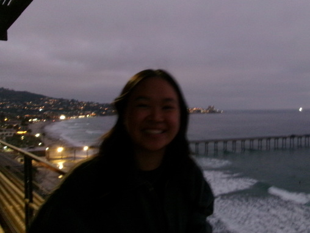

# Table of Contents
1. [About me](#about-me)
2. [Interests \& Hobbies](#interests--hobbies)
3. [Favorite Quote](#favorite-quote)
4. [Check out my 2026 DiamondHacks Project!](#check-out-my-2026-diamondhacks-project)
5. [My dog <3](#my-dog-)
6. [Quoting code](#random-code)
7. [Task List](#task-list)

## About me




<ins>3rd year</ins> - **CS major + Math minor** from _Orange County, CA_  😛

i also have a pug named 
[Milo](images/milo.JPG)!!


## Interests & Hobbies
- snowboarding, pickle ball, rock climbing, gymm
- trying new restaurants & boba/matcha in SD
- journaling

## Favorite Quote
> _good things take time :D_

## Check out my 2026 DiamondHacks Project!


[piggy.ai](https://piggy-ai.tech)


## My dog <3


## Random code
```python
print("Hello, World!")
```

## Task List
- [x] eat more food in SD
- [ ] get an internship

[Back to README](README.md)